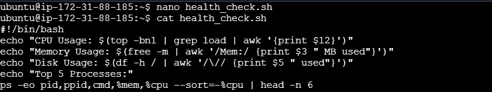
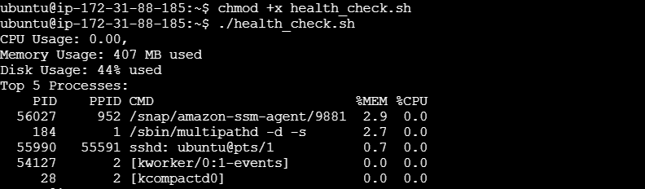
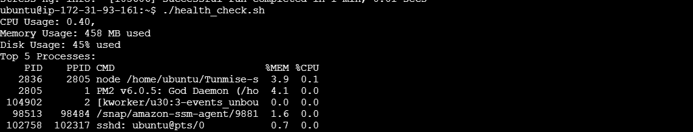

# advance-shell

# Script to check CPU usage, memory usage, disk usage, and running processes.
 

# Make the script executable.
# Run the script to check system health.
chmod +x health_check.sh
./health_check.sh

# Schedule the script to run every hour using cron.
 crontab -e 

# Modify the script to send an email if CPU usage exceeds 90%
